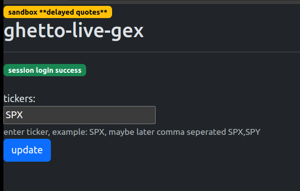

## ghetto-live-gex

```

*** DISCLAIMER ***

+ NOT FINANCIAL ADVICE

+ IF YOU NEED SUPPORT OR WANT TO USE THIS FOR TRADING, PLEASE OPT FOR A PAID SERVICE, FOR EXAMPLE: GEXBOT, SQUEEZMETRICS, UNUSUALWHALES, SPOTGAMMA, SPYGLASSEDGE

+ there have been no validation on the gex computation. feel free to contribute, this is as the name implies, as ghetto as it gets.

+ what i'm showing here is not gex, since i have not verified the data source and gex computation with other softwares/platforms.

+ now we get the disclaimer out of the way, do not ask for support in the issue section. i reserve all rights to not respond, maybe ping me on twitter, you should know my psuedo faceless handle `@` if you are here.

```

#### usage

```

+ you will first need to a apply for a TastyTrade trading account, then request for API acess, and get a Sandbox credential. this gets you access to 15-min delayed quotes. I have not gotten this API thing to work with production credentials yet, i locks me out immediately, and I can trade... so for now, am using only Sandbox for fun.

+ git clone the repo


+ add and populate `.env` file, see example `SAMPLE.env`.


+ spin it up `docker compose up -d`

+ in browser head to `http://localhost`, enter ticker `SPX` and click `update`



+ gex will be computed from events obtained 

```

#### gex references

+ squeeze metric https://squeezemetrics.com/monitor/download/pdf/white_paper.pdf

+ https://perfiliev.com/blog/how-to-calculate-gamma-exposure-and-zero-gamma-level

+ naive GEX https://www.youtube.com/watch?v=2XR_Y11hCBA

+ https://github.com/search?q=gex%20gamma%20exposure%20&type=repositories

#### technical references

+ unofficial api is the better one IMO https://github.com/tastyware/tastytrade

+ apis https://tastyworks-api.readthedocs.io/en/latest/data-streamer.html#advanced-usage

+ apis https://github.com/dxFeed/dxLink/blob/7cf19a85db196a23a70f6212ca1e5922e07f25e1/dxlink-specification/asyncapi.yml#L1387

#### ghetto tech stack

```

+ we are using the client with htmx to trigger events
+ all data being written to files.

python: unofficial python tastytrade api wrapper, asyncio, flask, pandas
js/html/bootstrap: htmx, apexcharts, bootstrap

```


#### tip!

+ [ ] tastytrade referal

+ [ ] cashapp,btc,lightning for donation

