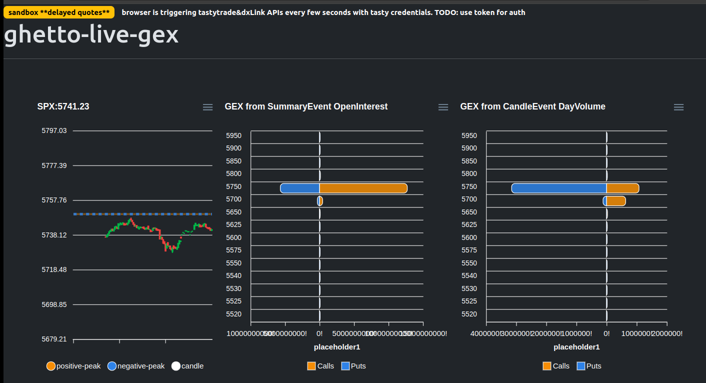

## ghetto-gex-live

```

this is an attempt to obtain/compute/view intraday gamma exposure (GEX)* using TastyTrade and dxLINK APIs

* SqueezeMetrics Research, "Gamma Exposure (GEX)" Dec. 2017. [Online] https://squeezemetrics.com/monitor/download/pdf/white_paper.pdf

```

# *** DISCLAIMER ***

##### + NOT FINANCIAL ADVICE

##### + IF YOU NEED SUPPORT OR WANT TO USE THIS FOR TRADING, PLEASE OPT FOR A PAID SERVICE, FOR EXAMPLE: GEXBOT, SQUEEZMETRICS, UNUSUALWHALES, SPOTGAMMA, SPYGLASSEDGE... the list goes on.

##### + there has been no validation on the gex computation. feel free to contribute, this is as the name implies, as ghetto as it gex.


##### + what i'm showing here is not gex, since i have not verified the data source and gex computation with other softwares/platforms.

##### + now we got the disclaimer out of the way, ask all the support you want in the issue section. i reserve every right to not respond, maybe ping me on twitter, you should know my psuedo faceless handle if you are here.

##### + if you want to further extend this... feel free to copy paste, fork it. Fork It. FORK IT.

### usage

+ you will first need to apply for a TastyTrade trading account [use my referal link](https://open.tastytrade.com/signup?referralCode=VH3PTJ43AD), then request for API access, and get a Sandbox credential. this gets you access to 15-min delayed quotes. You can also try to access the API with producion credentials, but be careful as it could lock your account if you are doing developer with constant get_session triggeres, so dont attempt doing dev with prod credentials, especially when you are actively trading, if account locked, you'll need to contact tastytrade for support.

+ git clone the repo

+ create and populate `ghetto-gex-live/.env` file, see example `ghetto-gex-live/SAMPLE.env`.

+ spin up service up with docker

```
cd ghetto-gex-live
docker compose up -d
```

+ in browser head to `http://localhost`, enter ticker `SPX` and click `update`


+ gex will be computed from events obtained 




#### gex references

+ squeeze metric https://squeezemetrics.com/monitor/download/pdf/white_paper.pdf

+ https://perfiliev.com/blog/how-to-calculate-gamma-exposure-and-zero-gamma-level

+ naive GEX https://www.youtube.com/watch?v=2XR_Y11hCBA


#### technical references

+ unofficial api is the better one IMO https://github.com/tastyware/tastytrade

    + https://github.com/tastyware/tastytrade/tree/master/tastytrade/dxfeed

    + big shout out to Graeme22 at [tastyware/ ](https://github.com/tastyware/tastytrade/commits?author=Graeme22), amazing library and documentation!!!

+ apis https://tastyworks-api.readthedocs.io/en/latest/data-streamer.html#advanced-usage

+ apis https://github.com/dxFeed/dxLink/blob/7cf19a85db196a23a70f6212ca1e5922e07f25e1/dxlink-specification/asyncapi.yml#L1387


#### ghetto tech stack

```

+ we are using the client with htmx to trigger events
+ all data being written to files.

python: unofficial python tastytrade api wrapper, asyncio, flask, pandas
js/html/bootstrap: htmx, apexcharts, bootstrap

```


#### tip me! i'm suffering from inflation!

+ signup for tastytrade via my [referral link](https://open.tastytrade.com/signup?referralCode=VH3PTJ43AD)!

+ i accept USD or BITCOIN, addresses available here: pangyuteng.com


##### what was the point of sharing all this and building this crap if you want to keep this so ghetto?


+ when you keep things very simple, modular, shit can be digested easily as oppose to diving deep into a jumbo pile of shit.  cooking shit up is a way for me to understand how things work, before I actualy use gex for actual trading.

+ once you spin this up during a trading day, all the events to that ticker is saved in lots of json files in the mounted docker volume. one tradining day of data will eat up about 8GB (for SPX) depending on how busy that day is. you can then play with that dataset if you like! this is one cheap way of getting you expensive historical option data for free and in a very very slow and uncleaned way.

+ i may or may not be working one a sperate private repo. few obvious nice to haves and seem interesting to me are:

    + saving data into postgre.

    + distribute the jobs since you want to watch multiple tickers.

    + compute and cache gex every second.

    + go back in time to watch gex just like @gexbot, so awesome.

    + gex profile alerts? for multiple tickers???? mind blown.

    + automated trading with gex??

    + the list goes on...

+ i may or may not caved in on the above todo list after having subscribed to gexbot.

+ ``
